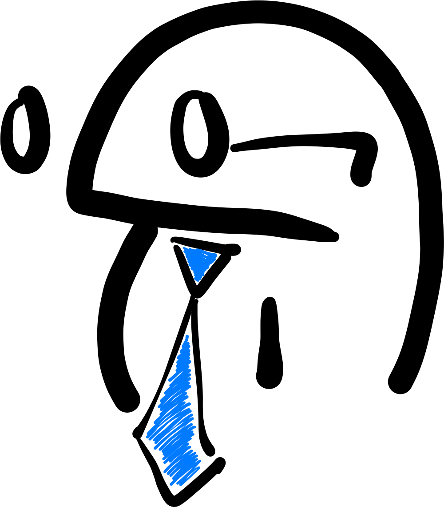

# Leetcode
One of my favorite pastimes includes learning and solving new Leetcode problems!

So, whether you are preparing for a technical interview or just looking to sharpen your programming skills, feel free to use this resource to find new problems or different approaches!

To learn more, feel free to contact me at 11.henrybliu@gmail.com! Happy coding!

<h2 style="text-align: center;">

</h2>

  Arrays & Hashing 

| # | Difficulty | Problem | My Solution |
| :---: | :---: | :----: | :---: |
| 217 | Easy | [Contains Duplicate](https://leetcode.com/problems/contains-duplicate/) | [python3](solutions/217.py) |
|  242 | Easy | [Valid Anagram](https://leetcode.com/problems/valid-anagram/) | [python3](solutions/242.py) |
|  1 | Easy | [Two Sum](https://leetcode.com/problems/two-sum/) | [python3](solutions/1.py) |
|  49 | Medium | [Group Anagrams](https://leetcode.com/problems/group-anagrams/) | [python3](solutions/49.py) |
|  347 | Medium | [Top K Frequent Elements](https://leetcode.com/problems/top-k-frequent-elements/) | [python3](solutions/347.py) |
|  248 | Medium | [Product of Array Except Self](https://leetcode.com/problems/product-of-array-except-self/) | [python3](solutions/238.py) |
|  36 | Medium | [Valid Sudoku](https://leetcode.com/problems/valid-sudoku/) | [python3](solutions/36.py) |
|  128 | Medium | [Longest Consecutive Sequence](https://leetcode.com/problems/longest-consecutive-sequence/) | [python3](solutions/128.py) |
|  392 | Easy | [Is Subsequence](https://leetcode.com/problems/is-subsequence/) | [python3](solutions/392.py) |
|  58 | Easy | [Length of Last Word](https://leetcode.com/problems/length-of-last-word/) | [python3](solutions/58.py) |
|  1299 | Easy | [Replace Elements With Greatest Element on Right Side](https://leetcode.com/problems/replace-elements-with-greatest-element-on-right-side/) | [python3](solutions/1299.py) |
|  14 | Easy | [Longest Common Prefix](https://leetcode.com/problems/longest-common-prefix/) | [python3](solutions/14.py) |
|  27 | Easy | [Remove Element](https://leetcode.com/problems/remove-element/description/) | [python3](solutions/27.py) |
|  929 | Easy | [Unique Email Addresses](https://leetcode.com/problems/unique-email-addresses/) | [python3](solutions/929.py) |
|  554 | Medium | [Brick Wall](https://leetcode.com/problems/brick-wall/) | [python3](solutions/554.py) |

Two Pointers

| # | Difficulty | Problem | My Solution |
| :---: | :---: | :----: | :---: |
|  881 | Medium | [Boats to Save People](https://leetcode.com/problems/boats-to-save-people/) | [python3](solutions/881.py) |
|  42 | Hard | [Trapping Rain Water](https://leetcode.com/problems/trapping-rain-water/) | [python3](solutions/42.py) |
|  11 | Medium | [Container With Most Water](https://leetcode.com/problems/container-with-most-water/) | [python3](solutions/11.py)|
|  15 | Medium | [3Sum](https://leetcode.com/problems/3sum/) | [python3](solutions/15.py) |
|  167 | Medium | [Two Sum II - Input Array is Sorted](https://leetcode.com/problems/two-sum-ii-input-array-is-sorted/) | [python3](solutions/167.py) |
|  125 | Easy | [Valid Palindrome](https://leetcode.com/problems/valid-palindrome/) | [python3](solutions/125.py) |

 Sliding Window 

| # | Difficulty | Problem | My Solution |
| :---: | :---: | :----: | :---: |

 Uncategorized / Problem of the Day 

| # | Difficulty | Problem | My Solution |
| :---: | :---: | :----: | :---: |
| 2706 | Easy | [Buy Two Chocolates](https://leetcode.com/problems/buy-two-chocolates/description/?envType=daily-question&envId=2023-12-20) | [python3](solutions/2706.py) |

